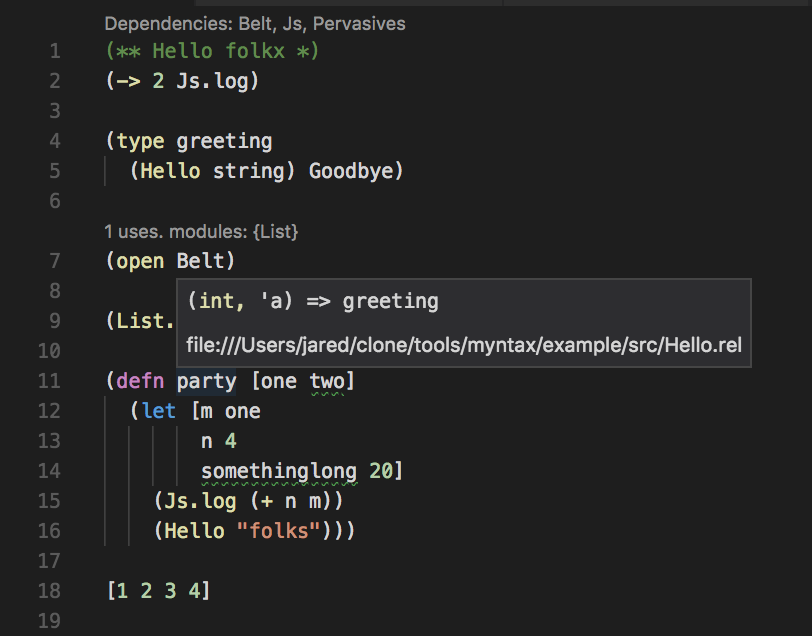

# reason-lisp-example

## How to use?

- `npm install`
- `npm run lisp` -- this starts a watcher that will transpile `.rel` files in `src/` to `.ml` files
- `npm start` -- start bucklescript in watch mode

Go to town!

For the IDE goodness, grab the [latest release](https://github.com/jaredly/reason-language-server/releases/tag/1.0.0-beta.6-1-2) of the reason-language-server vscode plugin

For a specification of the syntax, check out https://github.com/jaredly/myntax/blob/master/docs/LispGrammar.md.
